```R
# LAB Assignment - 5
# Report - 1
```


```R
library(bnlearn)
library(epiDisplay)
library(bnclassify)
library(e1071)
library(caret)
```

    Warning message:
    "package 'caret' was built under R version 3.6.3"


    Error: package or namespace load failed for 'caret' in loadNamespace(i, c(lib.loc, .libPaths()), versionCheck = vI[[i]]):
     namespace 'recipes' 0.1.5 is being loaded, but >= 0.1.10 is required
    Traceback:
    

    1. library(caret)

    2. tryCatch({
     .     attr(package, "LibPath") <- which.lib.loc
     .     ns <- loadNamespace(package, lib.loc)
     .     env <- attachNamespace(ns, pos = pos, deps, exclude, include.only)
     . }, error = function(e) {
     .     P <- if (!is.null(cc <- conditionCall(e))) 
     .         paste(" in", deparse(cc)[1L])
     .     else ""
     .     msg <- gettextf("package or namespace load failed for %s%s:\n %s", 
     .         sQuote(package), P, conditionMessage(e))
     .     if (logical.return) 
     .         message(paste("Error:", msg), domain = NA)
     .     else stop(msg, call. = FALSE, domain = NA)
     . })

    3. tryCatchList(expr, classes, parentenv, handlers)

    4. tryCatchOne(expr, names, parentenv, handlers[[1L]])

    5. value[[3L]](cond)

    6. stop(msg, call. = FALSE, domain = NA)


```R
grades.grades <- read.csv('2020_bn_nb_data.txt', sep = "\t", head = TRUE, stringsAsFactors=TRUE)
grades.courses <- grades.grades[, -9]
head(grades.courses)
```


<table>
<thead><tr><th scope=col>EC100</th><th scope=col>EC160</th><th scope=col>IT101</th><th scope=col>IT161</th><th scope=col>MA101</th><th scope=col>PH100</th><th scope=col>PH160</th><th scope=col>HS101</th></tr></thead>
<tbody>
	<tr><td>BC</td><td>CC</td><td>BB</td><td>BC</td><td>CC</td><td>BC</td><td>AA</td><td>BB</td></tr>
	<tr><td>CC</td><td>BC</td><td>BB</td><td>BB</td><td>CC</td><td>BC</td><td>AB</td><td>BB</td></tr>
	<tr><td>AB</td><td>BB</td><td>AB</td><td>AB</td><td>BB</td><td>CC</td><td>BC</td><td>AB</td></tr>
	<tr><td>BC</td><td>CC</td><td>BB</td><td>BB</td><td>BB</td><td>BB</td><td>BC</td><td>BB</td></tr>
	<tr><td>BC</td><td>AB</td><td>CD</td><td>BC</td><td>BC</td><td>BC</td><td>BC</td><td>CD</td></tr>
	<tr><td>DD</td><td>CC</td><td>DD</td><td>CD</td><td>CD</td><td>CC</td><td>BC</td><td>BC</td></tr>
</tbody>
</table>


```R
summary(grades.grades)
```


         EC100        EC160        IT101        IT161        MA101        PH100   
     BC     :48   BC     :59   BC     :49   BC     :49   BC     :54   CC     :40  
     CC     :36   CC     :47   CC     :42   CC     :42   BB     :52   BB     :36  
     BB     :35   CD     :37   CD     :35   BB     :35   CC     :49   BC     :34  
     F      :35   BB     :31   BB     :34   CD     :35   CD     :24   CD     :30  
     CD     :29   DD     :22   AB     :25   AB     :25   DD     :21   AA     :26  
     AB     :22   AB     :16   DD     :23   DD     :23   F      :15   AB     :26  
     (Other):27   (Other):20   (Other):24   (Other):23   (Other):17   (Other):40  
         PH160        HS101    QP     
     BC     :68   AA     :42   n: 72  
     CC     :43   BB     :40   y:160  
     AB     :32   BC     :36          
     BB     :30   AB     :34          
     AA     :27   DD     :29          
     CD     :21   CC     :26          
     (Other):11   (Other):25          


## Part 1: Learning Dependies between the courses


```R
# Using hill climbing search, we learn dependencies between different grades
```

### Using k2 score


```R
grades.hc.k2 <- hc(grades.courses, score = "k2")
grades.hc.k2
```


    
      Bayesian network learned via Score-based methods
    
      model:
       [IT161][IT101|IT161][MA101|IT101][HS101|IT101][EC100|MA101][PH160|HS101]
       [EC160|EC100][PH100|EC100]
      nodes:                                 8 
      arcs:                                  7 
        undirected arcs:                     0 
        directed arcs:                       7 
      average markov blanket size:           1.75 
      average neighbourhood size:            1.75 
      average branching factor:              0.88 
    
      learning algorithm:                    Hill-Climbing 
      score:                                 Cooper & Herskovits' K2 
      tests used in the learning procedure:  105 
      optimized:                             TRUE 
    


```R
plot(grades.hc.k2, main = "Hill Climbing with k2 score")
```


    
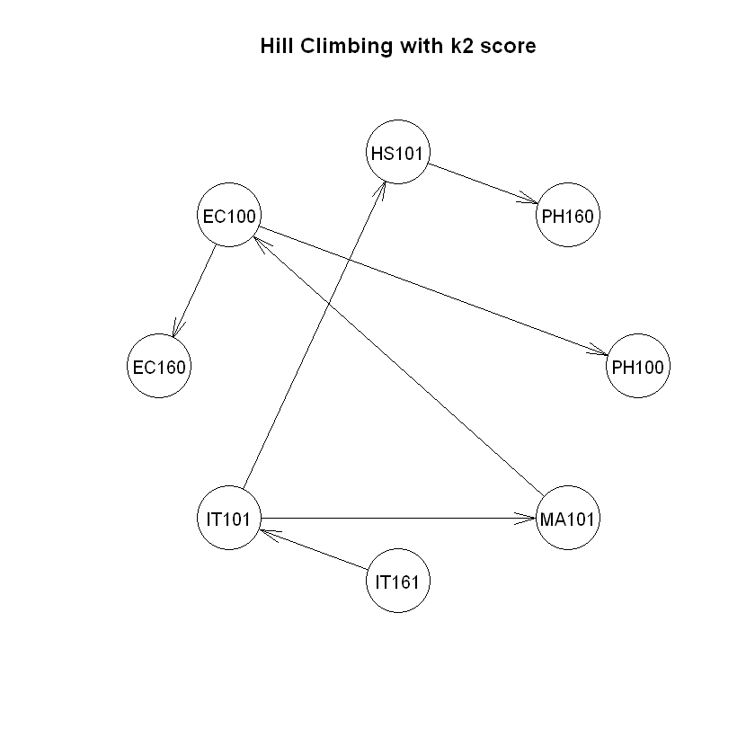
    


### Using bic score


```R
grades.hc.bic <- hc(grades.courses, score = "bic")
grades.hc.bic
```


    
      Bayesian network learned via Score-based methods
    
      model:
       [EC100][EC160][IT101][IT161][PH160][HS101][MA101|EC100][PH100|EC100] 
      nodes:                                 8 
      arcs:                                  2 
        undirected arcs:                     0 
        directed arcs:                       2 
      average markov blanket size:           0.50 
      average neighbourhood size:            0.50 
      average branching factor:              0.25 
    
      learning algorithm:                    Hill-Climbing 
      score:                                 BIC (disc.) 
      penalization coefficient:              2.723369 
      tests used in the learning procedure:  42 
      optimized:                             TRUE 
    


```R
plot(grades.hc.bic, main = "Hill Climbing with bic score")
```


    
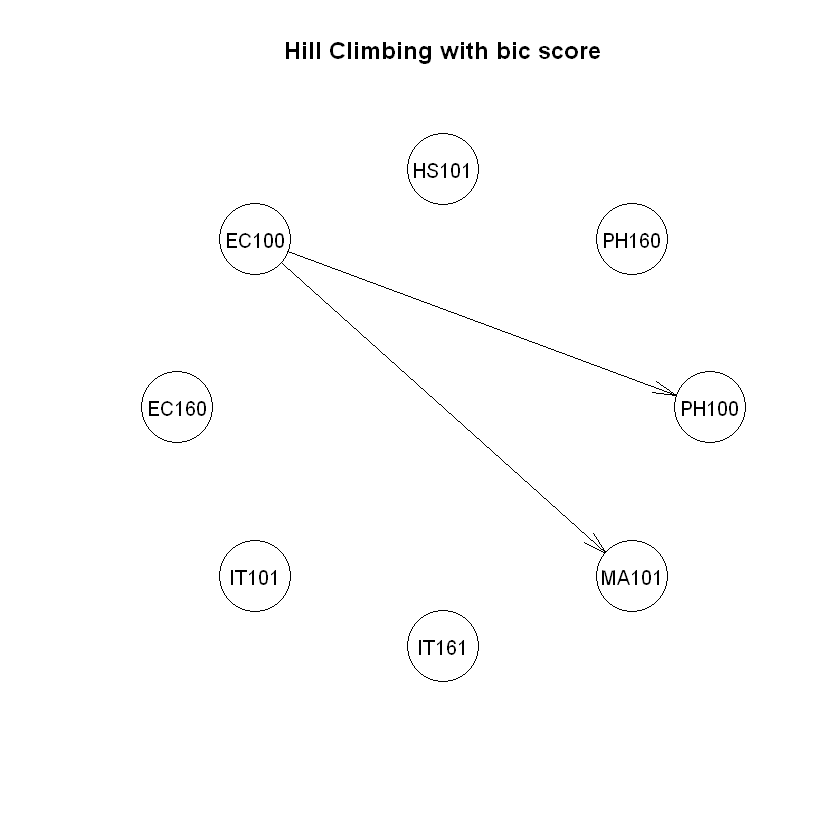
    


## Part 2: Learning the CPTs for each node


```R
# We'll use the network made using the k2 score, as it represents the the relations better.
```


```R
grades.courses.fitted <- bn.fit(grades.hc.k2, grades.courses)
```


```R
grades.courses.plots <- lapply(grades.courses.fitted, bn.fit.barchart)
```


    
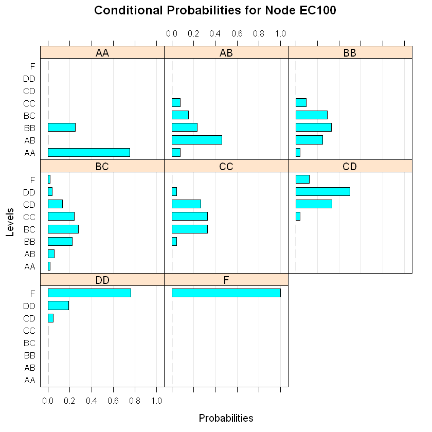
    


    
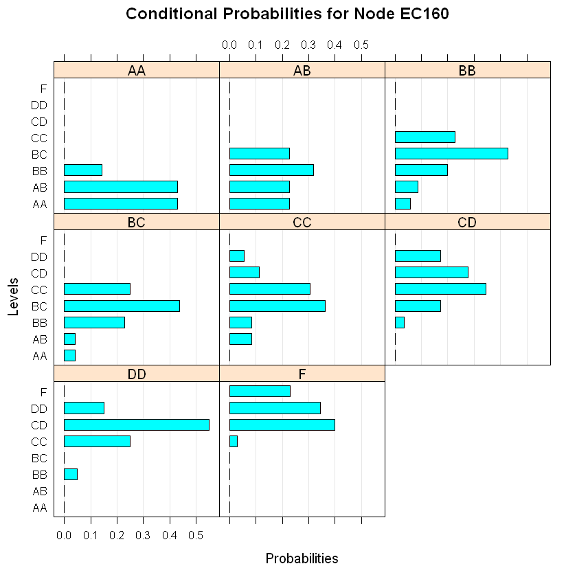
    


    
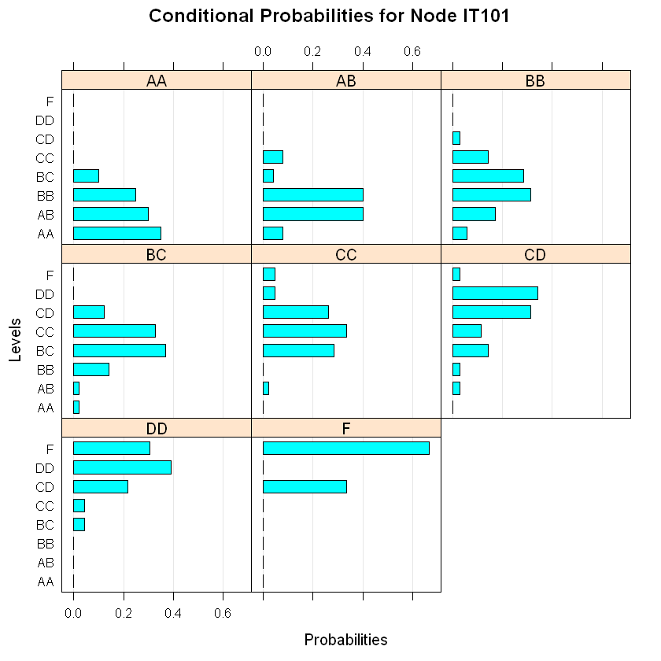
    


    
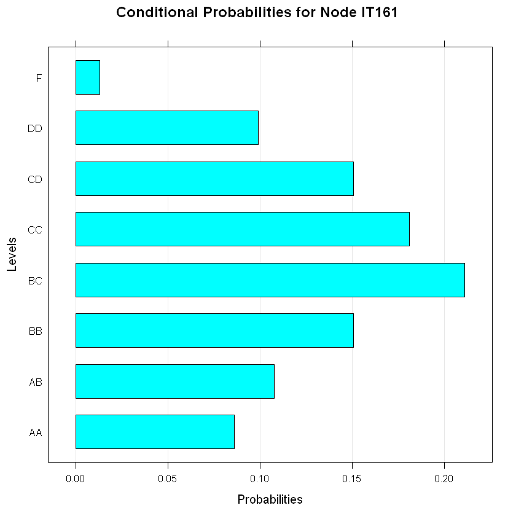
    


    
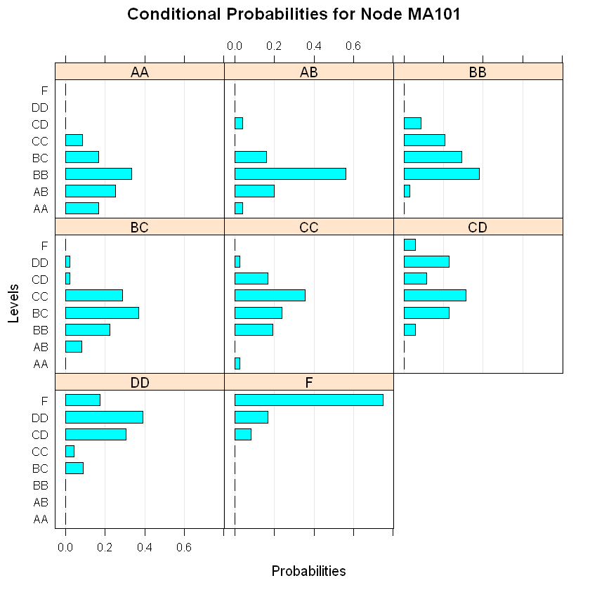
    


    
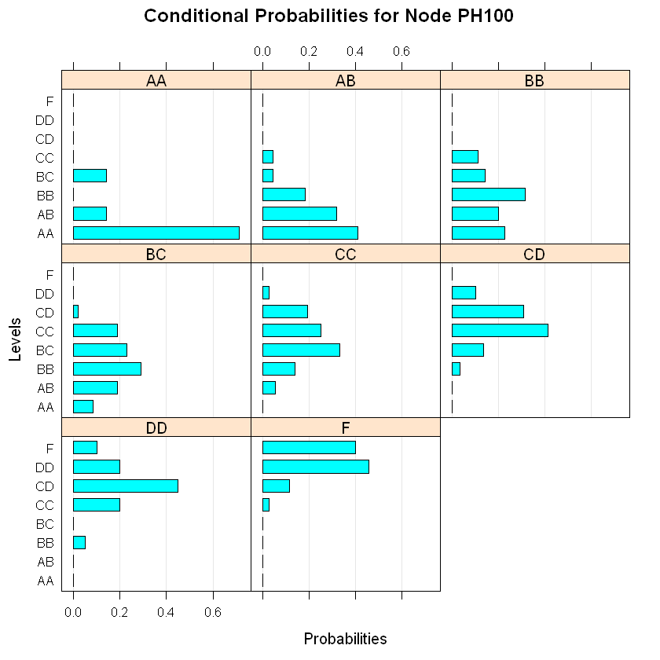
    


    
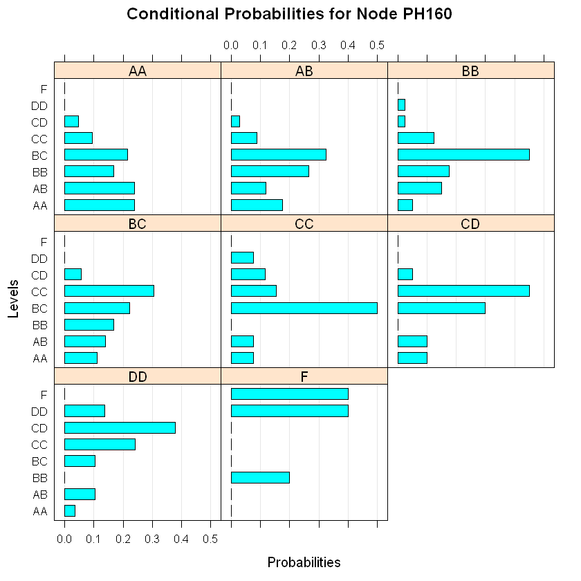
    


    
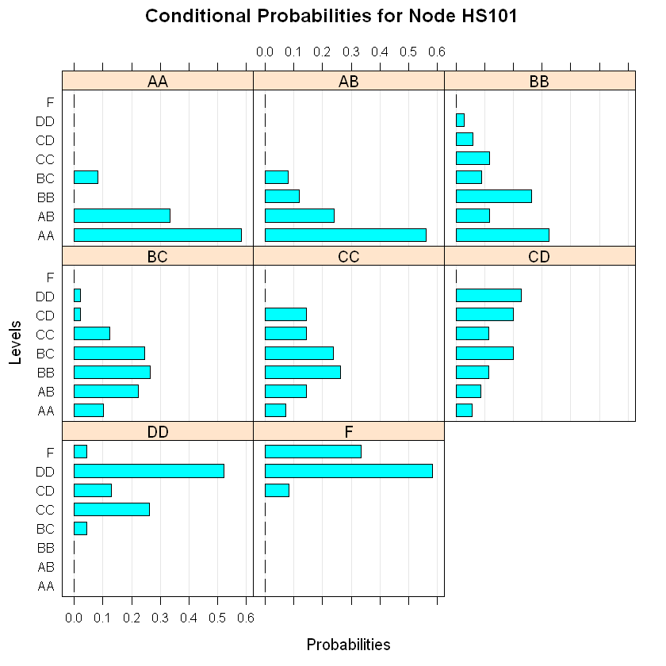
    


## Part 3: What grade will a student get in PH100 if he earns DD in EC100, CC in IT101 and CD in MA101


```R
grades.courses.PH100Grade <- data.frame((cpdist(grades.courses.fitted, nodes=c("PH100"), evidence= (EC100 == "DD") & (IT101 == "CC") & (MA101 == "CD"))))
tab1(grades.courses.PH100Grade, sort.group = "decreasing", main = "Distribution of grades in PH100 with given evidence")
```


<dl>
	<dt>$first.line</dt>
		<dd>'grades.courses.PH100Grade : \n'</dd>
	<dt>$output.table</dt>
		<dd><table>
<thead><tr><th></th><th scope=col>Frequency</th><th scope=col>Percent</th><th scope=col>Cum. percent</th></tr></thead>
<tbody>
	<tr><th scope=row>CD</th><td> 95  </td><td> 41.3</td><td> 41.3</td></tr>
	<tr><th scope=row>DD</th><td> 49  </td><td> 21.3</td><td> 62.6</td></tr>
	<tr><th scope=row>CC</th><td> 47  </td><td> 20.4</td><td> 83.0</td></tr>
	<tr><th scope=row>F</th><td> 24  </td><td> 10.4</td><td> 93.5</td></tr>
	<tr><th scope=row>BB</th><td> 15  </td><td>  6.5</td><td>100.0</td></tr>
	<tr><th scope=row>BC</th><td>  0  </td><td>  0.0</td><td>100.0</td></tr>
	<tr><th scope=row>AB</th><td>  0  </td><td>  0.0</td><td>100.0</td></tr>
	<tr><th scope=row>AA</th><td>  0  </td><td>  0.0</td><td>100.0</td></tr>
	<tr><th scope=row>  Total</th><td>230  </td><td>100.0</td><td>100.0</td></tr>
</tbody>
</table>
</dd>
</dl>


    
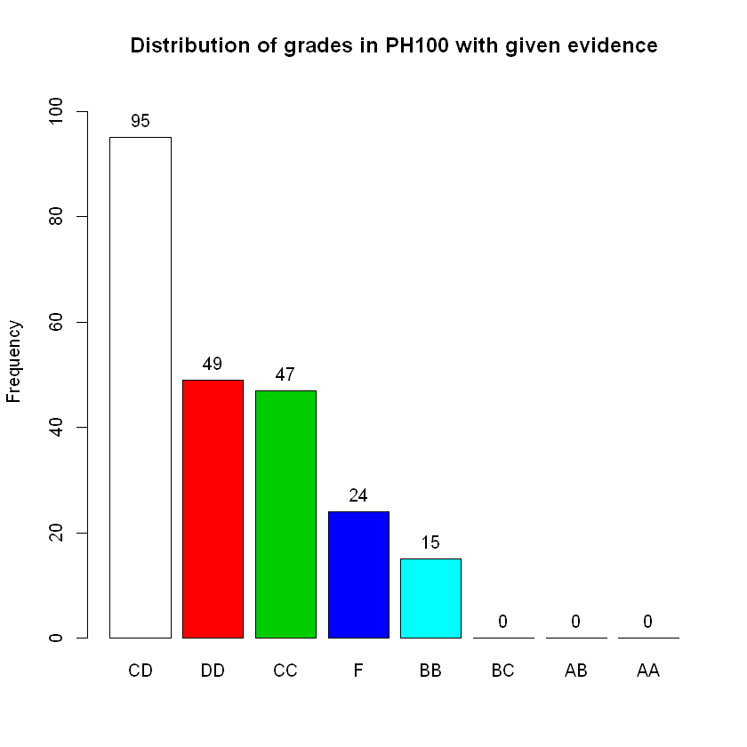
    


```R
# Therefore, the student is most likely to earn a CD grade.
```

## Splitting Data into test and train sets


```R
split <- sample(c(rep(0, 0.7*nrow(grades.grades)), rep(1, 0.3*nrow(grades.grades))))
table(split)
```


    split
      0   1 
    162  69 


```R
data_train <- grades.grades[split == 0,]
data_test <- grades.grades[split == 1,]
head(data_test)
```


<table>
<thead><tr><th></th><th scope=col>EC100</th><th scope=col>EC160</th><th scope=col>IT101</th><th scope=col>IT161</th><th scope=col>MA101</th><th scope=col>PH100</th><th scope=col>PH160</th><th scope=col>HS101</th><th scope=col>QP</th></tr></thead>
<tbody>
	<tr><th scope=row>2</th><td>CC</td><td>BC</td><td>BB</td><td>BB</td><td>CC</td><td>BC</td><td>AB</td><td>BB</td><td>y </td></tr>
	<tr><th scope=row>6</th><td>DD</td><td>CC</td><td>DD</td><td>CD</td><td>CD</td><td>CC</td><td>BC</td><td>BC</td><td>n </td></tr>
	<tr><th scope=row>7</th><td>BC</td><td>BB</td><td>CD</td><td>CC</td><td>CC</td><td>BC</td><td>BB</td><td>AB</td><td>y </td></tr>
	<tr><th scope=row>8</th><td>BB</td><td>CC</td><td>CC</td><td>CC</td><td>BB</td><td>BB</td><td>BB</td><td>BC</td><td>y </td></tr>
	<tr><th scope=row>9</th><td>AA</td><td>AB</td><td>AA</td><td>AA</td><td>AA</td><td>AA</td><td>BB</td><td>AB</td><td>y </td></tr>
	<tr><th scope=row>10</th><td>BB</td><td>BB</td><td>BC</td><td>CC</td><td>AB</td><td>AA</td><td>AB</td><td>AA</td><td>y </td></tr>
</tbody>
</table>


```R
 # Putting it all in a function
```


```R
split_data <- function() {
  split <- sample(c(rep(0, 0.7*nrow(grades.grades)), rep(1, 0.3*nrow(grades.grades))))
  data_train <- grades.grades[split == 0,]
  data_test <- grades.grades[split == 1,]
  list("data_train" = data_train, "data_test" = data_test)
    }
```

## Part 4: Naive Bayes classifier for independent data


```R
#making the NB with class with traing dataset
nb.grades_indep <- nb(class = "QP", dataset = data_train)
#learning the parameter
nb.grades_indep <- lp(nb.grades_indep, data_train, smooth = 0)
plot(nb.grades_indep)
#predicting the class with probability with test data
p <- predict(nb.grades_indep,data_test, prob=TRUE)
print(head(p))
```

         n y
    [1,] 0 1
    [2,] 1 0
    [3,] 0 1
    [4,] 0 1
    [5,] 0 1
    [6,] 0 1
    


    
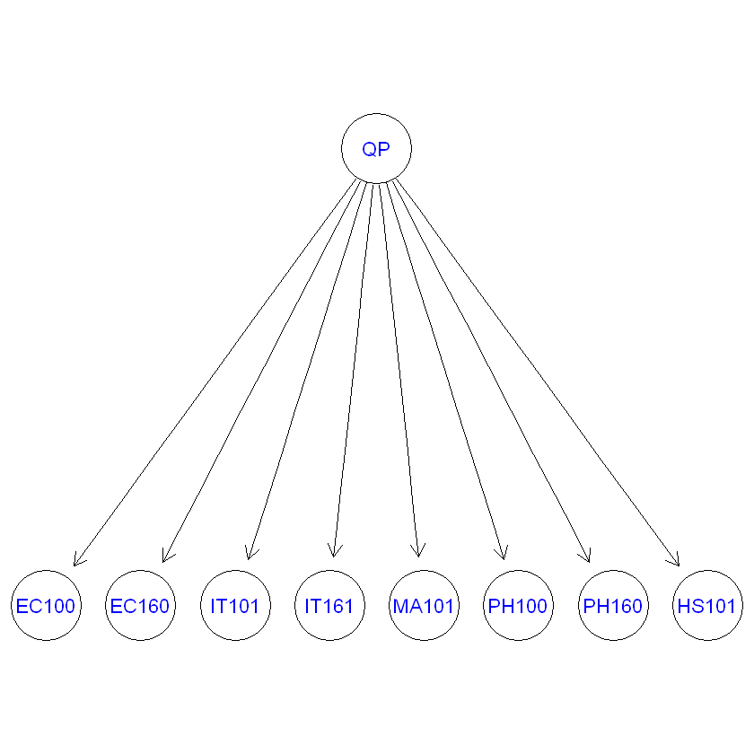
    


```R
# prdicting the class without probability with test data
p_indep <- predict(nb.grades_indep, data_test)
# confusionMatrix(p_indep, data_test$QP)
cm <- table(predicted=p_indep, true=data_test$QP)
cm
```


             true
    predicted  n  y
            n 20  0
            y  4 45


```R
#Repeating this 20 times
```


```R
for (i in 1:20){
  data <- split_data()
  data_test <- data$data_test
  data_train <- data$data_train
  nb.grades_indep <- nb(class = "QP", dataset = data_train)
  nb.grades_indep <- lp(nb.grades_indep, data_train, smooth = 0)
  p_indep <- predict(nb.grades_indep, data_test)
  print(accuracy(p_indep, data_test$QP))
}
```

    [1] 0.9565217
    [1] 0.9710145
    [1] 0.9
    [1] 0.9571429
    [1] 1
    [1] 0.9130435
    [1] 0.8985507
    [1] 0.942029
    [1] 0.9714286
    [1] 0.9710145
    [1] 0.942029
    [1] 0.8985507
    [1] 0.9571429
    [1] 0.9130435
    [1] 1
    [1] 0.9571429
    [1] 0.9565217
    [1] 1
    [1] 0.9428571
    [1] 0.9710145
    

## Part 5: Naive Bayes classifier for dependent data


```R
nb.grades_dep <- tan_cl("QP", data_train)
nb.grades_dep <- lp(nb.grades_dep, data_train, smooth = 1)
plot(nb.grades_dep)
```


    
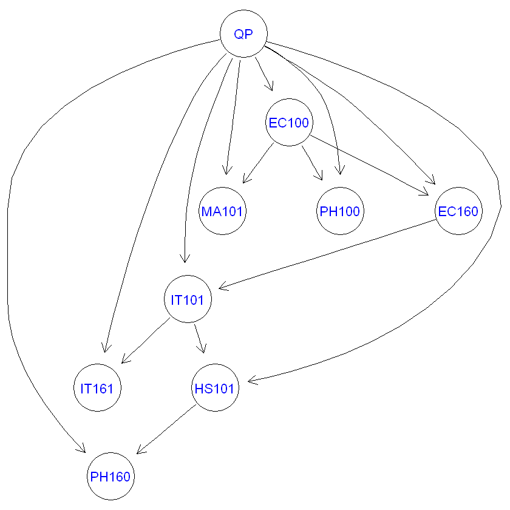
    


```R
p_dep <- predict(nb.grades_dep, data_test)
cm <- table(predicted=p_dep, true=data_test$QP)
cm
```


             true
    predicted  n  y
            n 23  0
            y  4 42


```R
# Repeating this 20 times
```


```R
for (i in 1:20){
  data <- split_data()
  data_test <- data$data_test
  data_train <- data$data_train
  nb.grades_dep <- tan_cl("QP", data_train)
  nb.grades_dep <- lp(nb.grades_dep, data_train, smooth = 1)
  p_dep <- predict(nb.grades_dep, data_test)
  print(accuracy(p_dep, data_test$QP))
    }
```

    [1] 0.9565217
    [1] 0.9710145
    [1] 0.9275362
    [1] 0.942029
    [1] 0.942029
    [1] 0.942029
    [1] 0.9428571
    [1] 0.9275362
    [1] 0.9275362
    [1] 0.9571429
    [1] 0.9275362
    [1] 0.9565217
    [1] 0.9285714
    [1] 0.942029
    [1] 0.9710145
    [1] 0.9565217
    [1] 0.9714286
    [1] 0.9275362
    [1] 0.9285714
    [1] 0.942029
    
